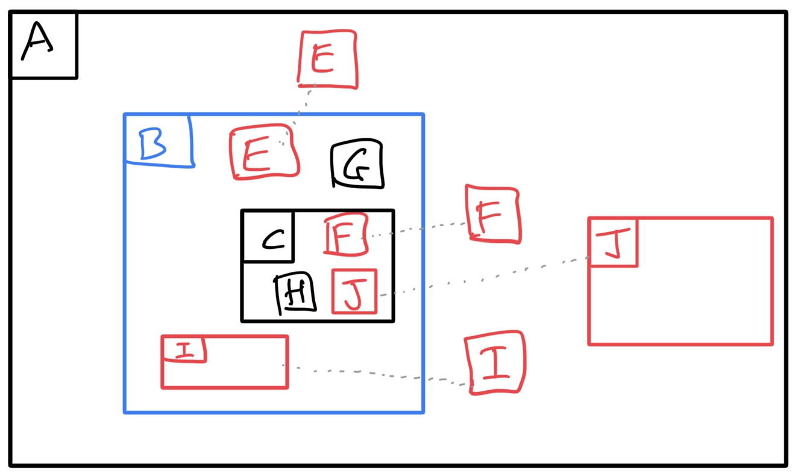

* If moving view B, then components E, F, I and J are also present in other views (A).
* Views B & C and components B (may not exist), C (may not exist), G and H will be moved.
* E and F can optionally be moved.
* Both the view and component of I must be moved.
* Both the view and component of J must not be moved.
